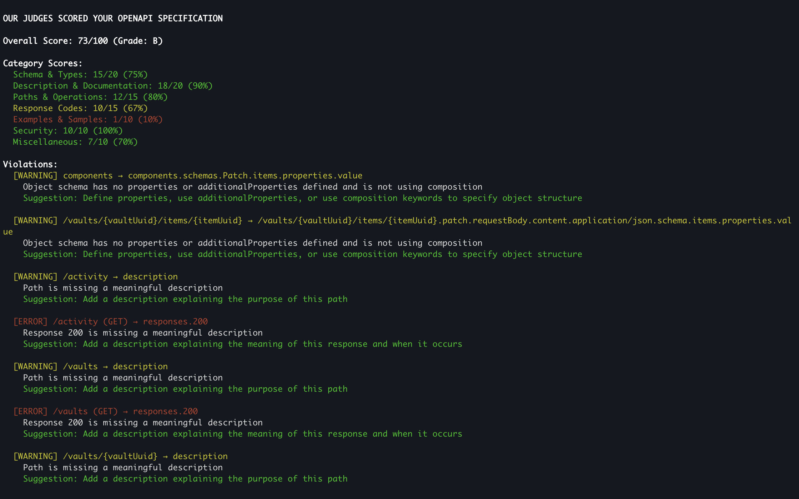
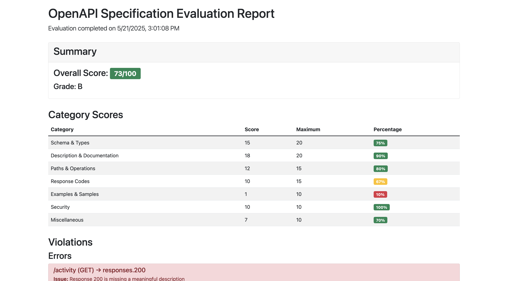
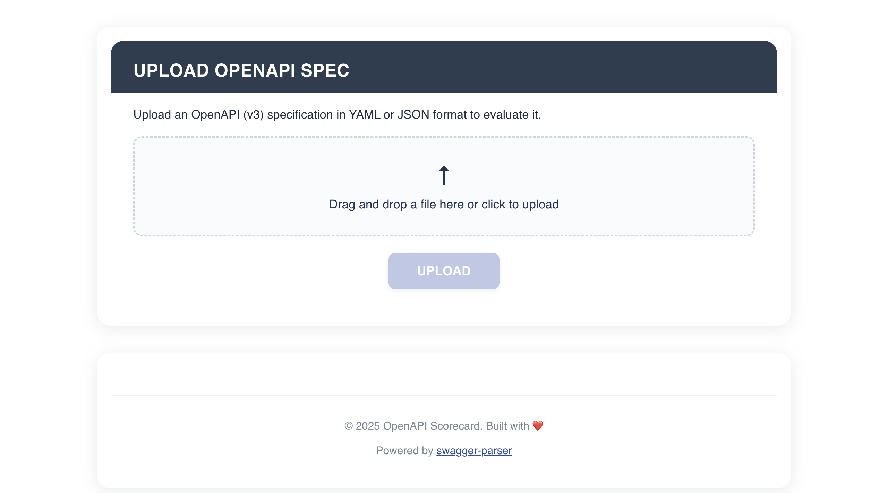
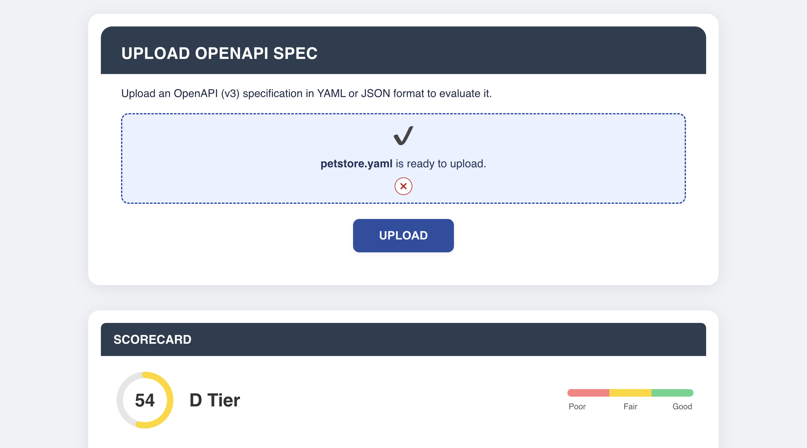
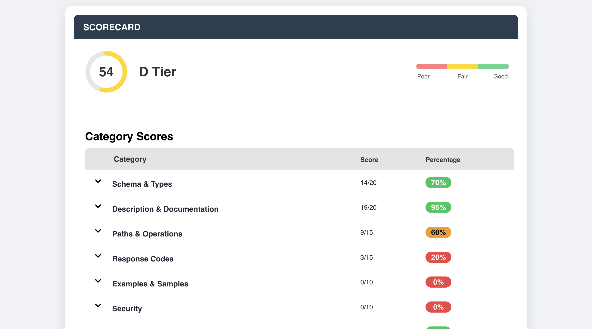

# OpenAPI Evaluator App

A powerful tool for evaluating, scoring, and validating OpenAPI specifications against best practices and standards.

## 📋 Overview

OpenAPI Evaluator analyzes your OpenAPI specifications and provides detailed feedback on quality, completeness, and adherence to best practices. It generates comprehensive reports with actionable insights to improve your API documentation.

## 🚀 Features

- **Automated Scoring**: Evaluate OpenAPI specs against multiple rule categories
- **Detailed Reports**: Get comprehensive feedback on violations and improvement areas
- **Interactive UI**: Visualize scores and violations in a user-friendly interface
- **CLI Support**: Run evaluations directly from the command line
- **Multiple Export Formats**: Generate reports in Markdown, HTML, or JSON

## 🏗️ Design Decisions

| Decision | Rationale |
|----------|-----------|
| **Modular Architecture** | Separates concerns between parsing, rule evaluation, and reporting, making the codebase easier to extend and maintain. |
| **Rule-based Evaluation** | Each rule is implemented as a separate module, allowing for easy addition of new rules and customization of existing ones. |
| **Multiple Output Formats** | Supports console, Markdown, HTML, and JSON outputs to accommodate different use cases and integration scenarios. |
| **WebUI + CLI Modes** | Provides flexibility for both interactive usage via web interface and automated/CI integration via command line. |
| **Scoring System** | Quantifies API quality through weighted rule categories, providing actionable metrics for improvement. |
| **Extensible Reporting** | The Announcer pattern allows for easy addition of new report formats without modifying core evaluation logic. |

## 🛠️ Installation

### Prerequisites

- Node.js (v12 or higher)
- npm (v6 or higher)

### Setup

Clone the repository and install dependencies:

```bash
git clone https://github.com/ngval22/openapi-evaluator-app.git 
cd openapi-evaluator-app
npm install
```

## 📊 Usage

### Web UI setup

```bash
# Build the application
npm run build

# Start the application
npm run dev
```

Then open your browser and you can access the application at: http://localhost:8080/

### Command Line Interface

Evaluate an OpenAPI specification file:

```bash
# Basic usage
npm run cli -- path/to/your/openapi.yaml

# Using sample file
npm run cli -- --sample

# Export as Markdown
npm run cli -- path/to/your/openapi.yaml --markdown

# Export as HTML
npm run cli -- path/to/your/openapi.yaml --html

# Export as JSON
npm run cli -- path/to/your/openapi.yaml --json

# Specify output filename
npm run cli -- path/to/your/openapi.yaml --html --output my-report

# Specify output directory
npm run cli -- path/to/your/openapi.yaml --html --output-dir ./reports
```

### Options

```
Options:
  -d, --debug           Print the parsed OpenAPI spec to console
  --sample              Run the evaluation on a sample OpenAPI specification
  --markdown            Export the report in Markdown format
  --json                Export the report in JSON format
  --html                Export the report in HTML format
  -o, --output <name>   Specify output filename (without extension)
  --output-dir <dir>    Specify output directory for reports (default: ./reports)
  -h, --help            Display help information
  -v, --version         Display version information
```

## 🧪 Rule Categories

The evaluator checks your OpenAPI specification against the following rule categories:

- **Documentation**: Completeness of descriptions, summaries, and examples
- **Path Design**: RESTful design principles and URL structure
- **Schema Definitions**: Data model completeness and consistency
- **Response Codes**: Appropriate status codes and error handling
- **Security**: Authentication and authorization definitions
- **Examples**: Presence and quality of examples
- **Miscellaneous**: Other best practices and conventions

## 🖥️ Development

Start the development server:

```bash
npm run dev
```

This runs both the backend server and frontend development server concurrently.

### Building

```bash
npm run build
```

This compiles TypeScript files and bundles the web interface.

### Testing

```bash
# Run all tests
npm test

# Run tests with watch mode
npm run test:watch

# Generate test coverage report
npm run test:coverage
```

## 📸 Screenshots

### Command Line Output


### HTML Report


### Web Interface
|  |
|:--:|
| *Interactive evaluation in the web interface* |
|  |
|:--:|
| *Interactive evaluation in the web interface* |
|  |
|:--:|
| *Interactive evaluation in the web interface* |
## 📄 License

This project is licensed under the MIT License - see the LICENSE file for details.

## 📞 Support

If you encounter any issues or have questions, please file an issue on the GitHub repository or contact me: n.gvalia84@gmail.com
